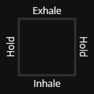
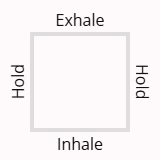

# bbbreathing
<div>


</div>

### Box breathing with a 4 second pattern

## Project structure
```
PROJECT_ROOT
├── public               # static assets
│   └── styles           # stylesheets
├── src
│   ├── components       # Astro components
│   ├── layouts          # page layouts
│   ├── pages            # page files
└──
```